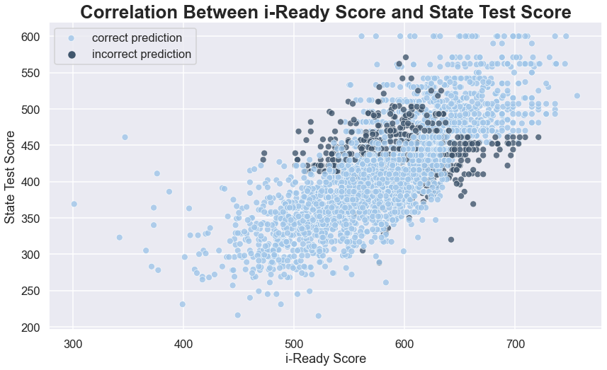

# Assessment Data


## Summary of Data Cleaning

The data tables were already combined and a check of user ids validated that the join seemed correct.

The following records were removed:

- records with missing i-Ready data (3)
- records with "E" or "M" indicated for state score (8)
- records with state test scores below 200 or above 600 (3)
- records where the student's grade level did not match their test level (29)

**In total, 43 records (1.5%) were removed.**

The following records had new values imputed:

- missing proficiencies calculated using scores (5)
- i-Ready scores coded as 0, "P" and "X" were replaced with the mean values for the students that were in the same grade level and had the same i-Ready placement level (3)
- i-Ready scores below 100 or above 800 were replaced with the mean as above (5)


## Summary of Data


5th, 6th and 8th grades have above the average number of students, while 7th grade has the fewest students.


The median score is consistent throughout the grades. The scores appear to be less variable in 7th and 8th grade, but this may be to differences in the maximum and minimum scores for those tests. 


Proficiency is highest in 3rd, consistent in 4th-6th and then drops off in 7th and 8th grade.


In 3rd-6th, the predicted proficient rates are lower than the actual proficient rates. In 8th grade, this is reversed with students scoring not proficient after a prediction of proficient.


We can see that the incorrect classifications occur in every grade level and tend to be be clustered. Interestingly, the misclassified points are not centered around the boundary scores for proficiency. Overall, there is an 84% accuracy on classification.


The distribution of scores is not consistent across schools, where some are clearly outperforming others. With additional information on the schools, it would be interesting to compare schools with similar demographics and different score distributions.


There are only two schools with a higher percentage of proficient students than not proficient ones.



The relationship between i-Ready scores and state test scores is generally positive and linear. There are some outliers on the left side, where students performed significantly better on the actual test than on the i-Ready assessment. This suggests that one issue that can impact validity of scores is that students may not take "practice" tests seriously. 

**The overall correlation between scores is 0.74**, which is a moderately strong correlation. The correlation varies across grade levels:

- The correlation between scores for grade 3 is 0.79
- The correlation between scores for grade 4 is 0.83
- The correlation between scores for grade 5 is 0.84
- The correlation between scores for grade 6 is 0.82
- The correlation between scores for grade 7 is 0.76
- The correlation between scores for grade 8 is 0.76


Over half of the students performed below grade level on the i-Ready assessment, indicating that they need extra support. Enrichment opportunities can be provided for the slightly more than 10% scoring above grade level.


There is more variability in the levels of the students performing below grade level.


## Future Work

- With the linear relationship between scores, it would make sense to fit a linear model to the date in order to predict test scores from i-Ready scores. With the provided information, I would use the grade level information (one-hot encoded since it is categorical) and the i-Ready scores as the dependent variables and the test score as the dependent variable. 

- I would also check to see if I could train a classification model on the data to improve upon the 84% accuracy rate. 


**A note on graph selection**
Bar charts were used to show the relationships between counts or rates of categorical variables. They are easy to read and understand.

Box plots were used to compare multiple distributions of univariate continuous variables. While histograms can be a little easier to read, they are difficult to compare among multiple groups.

A scatter plot was used to show the distribution of scores and accuracy of predictions across grade levels because it makes it easy to see any patterns.

Finally, a scatter plot was used to show the correlation between the two continuous score variables. 


```python

```
